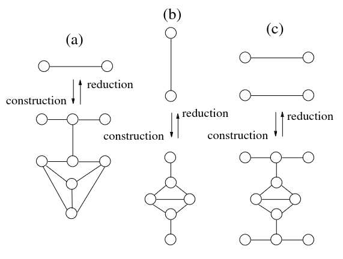
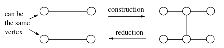
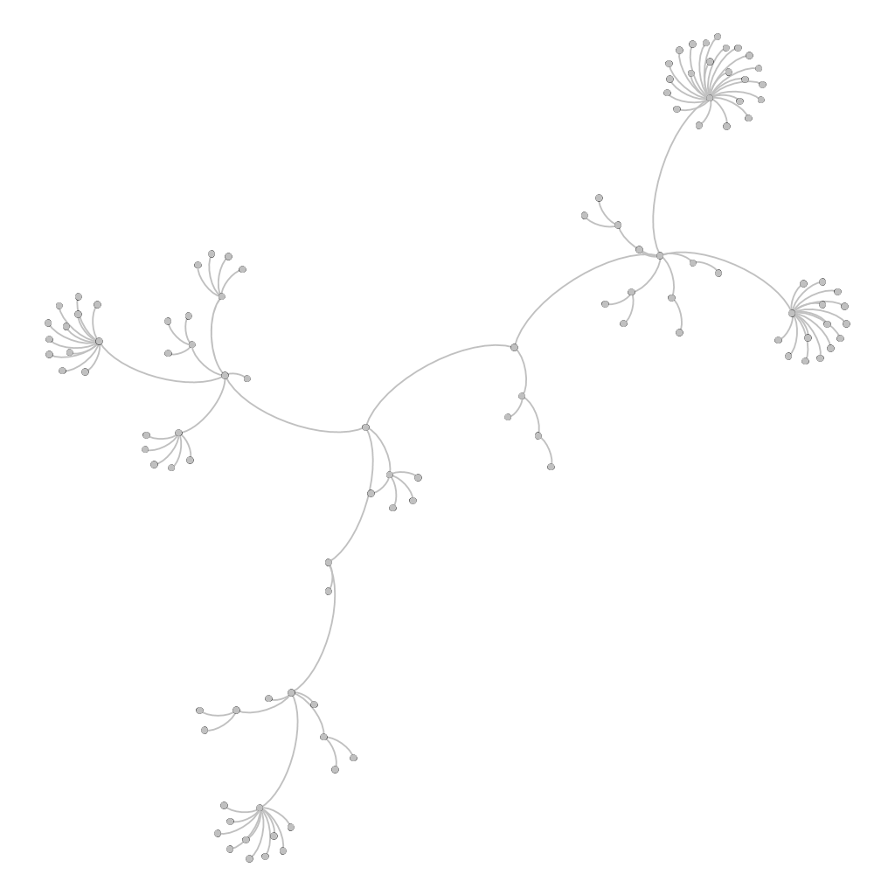
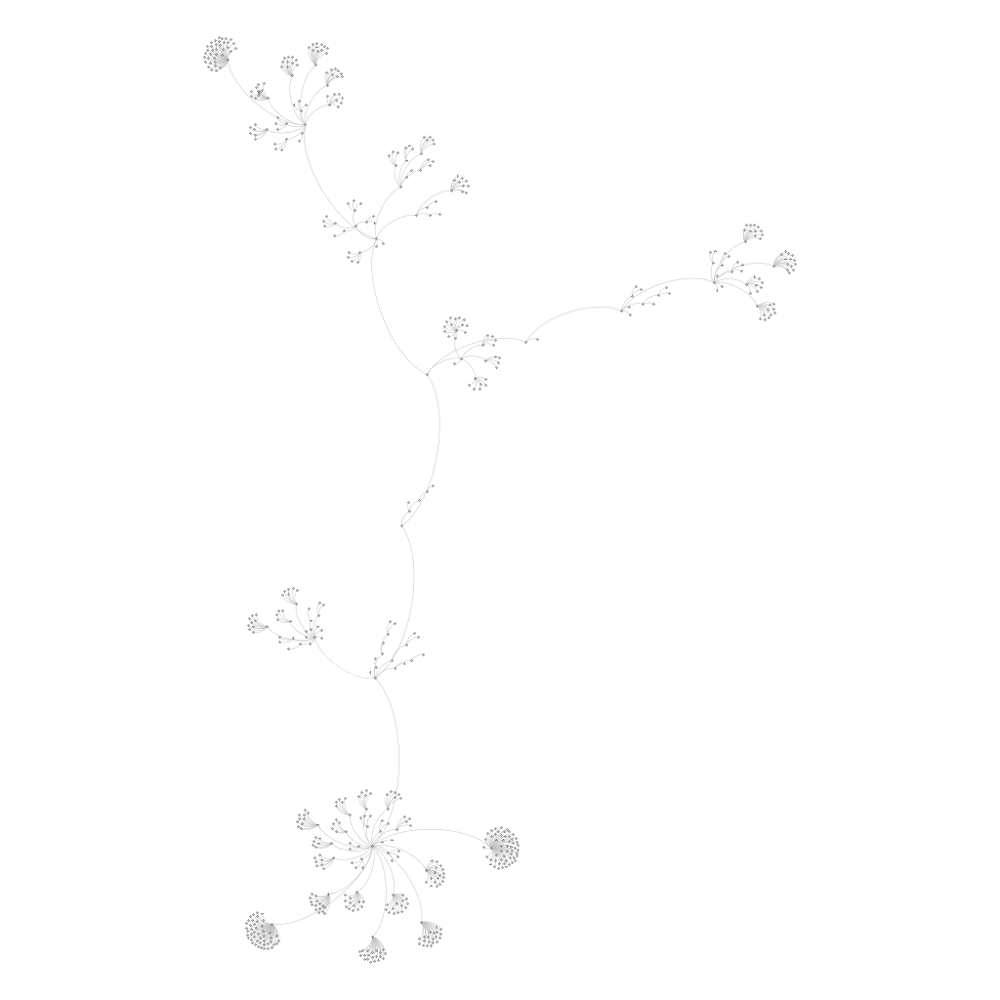
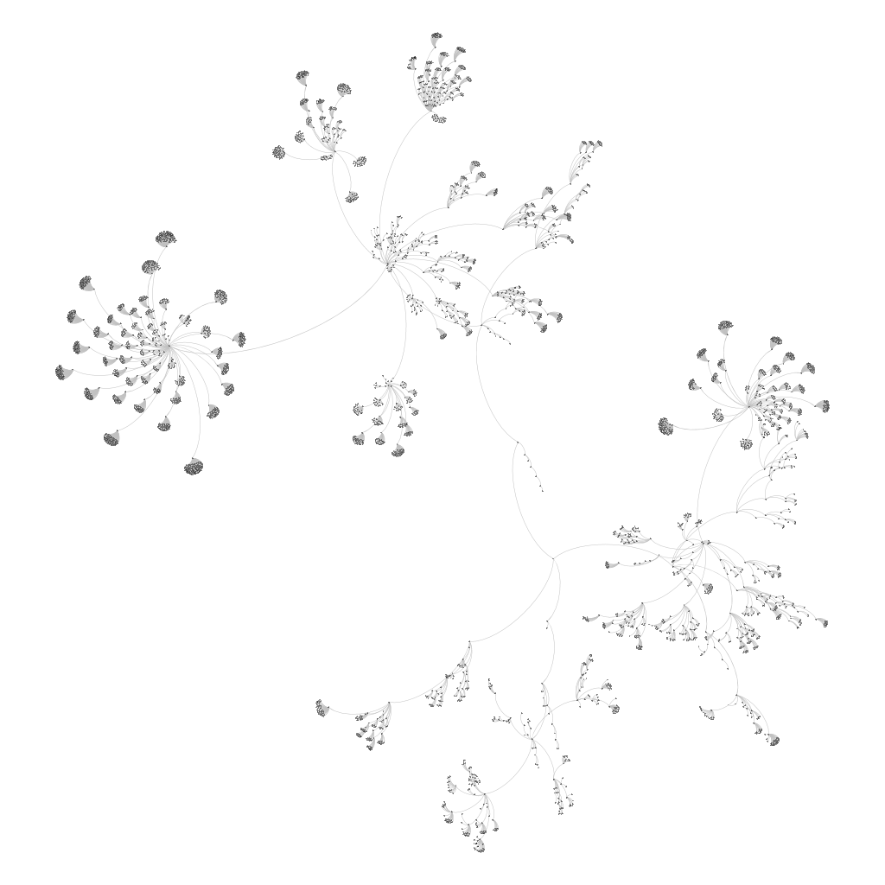

# Cubic Graph Generation

**Cubic Graph Generation** is a project aimed at efficiently generating cubic graphs. The main objective was to implement an algorithm for enumerating prime cubic graphs using recursive calls, following the guidelines outlined in the paper *"Fast Generation of Cubic Graphs"* by Brinkmann et al.

The algorithm follows a specific sequence of operations, including enumerating prime cubic graphs starting from a K4 graph and applying transformations (insertions) such as Adjacent Diamond, Non-Adjacent Diamond, and Lollipop to generate additional prime cubic graphs. At each step of this recursive algorithm, duplicates are efficiently managed, leveraging their properties and the nauty library. Finally, once all possible prime graphs are obtained, the remaining cubic graphs are generated through additional edge insertions.

The generated graphs are organized in an n-ary tree, and pointers to the graphs can be randomly accessed.

In conclusion, the project has successfully developed an efficient algorithm for enumerating cubic graphs and studied the process of generating the enumeration tree using visualization techniques. The primary goal was to identify patterns for generating graphs *"uniformly at random"*.

The project was completed as part of the [Information Visualization](www.dia.uniroma3.it/~infovis/) course at [Roma Tre University](https://ingegneriacivileinformaticatecnologieaeronautiche.uniroma3.it/) by the authors [Luca Gregori](https://www.linkedin.com/in/l-gregori/) and Alessandro Wood. For more information, please refer to the [References](#references) section.

## Table of Contents

- [Algorithm Explanation](#algorithm-explanation)
    - [Enumerating Prime Cubic Graphs](#enumerationg-prime-cubic-graphs)
    - [Generating Remaining Cubic Graphs](#generating-remaining-cubic-graphs)
- [Relevant functions](#relevant-functions)
    - [Graph Generation Functions](#graph-generation-functions)
    - [Graph Transformation Functions](#graph-transformation-functions)
    - [Graph Irreducibility Checking Functions](#graph-irreducibility-checking-functions)
    - [Graph Enumeration Management Functions](#graph-enumeration-management-functions)
    - [Utility Functions](#utility-functions)
- [Installation](#installation)
- [Usage](#usage)
- [Visualization of enumeration trees using Gephi](#visualization-of-enumeration-trees-using-gephi)
    - [12 Vertices](#12-vertices)
    - [14 Vertices](#14-vertices)
    - [16 Vertices](#16-vertices)
- [References](#references)

## Algorithm Explanation

The implemented algorithm is a cubic graph enumeration algorithm that aims to efficiently generate cubic graphs. The process involves two main steps: enumerating prime cubic graphs and generating the remaining cubic graphs through edge insertions.

### Enumerating Prime Cubic Graphs

The algorithm starts by randomly selecting a cubic graph with **N** nodes using the function [`generateUniform()`](#generate-uniform-graph). It then proceeds to enumerate prime cubic graphs, which are cubic graphs with all irreducible edges. The enumeration of prime cubic graphs follows a recursive approach and involves three transformations: Adjacent Diamond Insertion, Non-Adjacent Diamond Insertion, and Lollipop Insertion. These transformations are applied starting from the K4 graph, which is generated using [`initIrreducibleGraph()`](#initialize-irreducible-graph).

The three transformations are as follows:

- (a) Lollipop Insertion [`lollipopInsertion()`](#lollipop-insertion): It generates a K4+ (K4 with one edge removed and a new node connected to the endpoints of the removed edge), which is inserted between an existing edge. The connection is made in such a way that a new middle node is created between the existing edge, and it is then connected to the K4+ through the node that connects the endpoints of the removed edge.

- (b) Adjacent Diamond Insertion [`adjDiamondInsertion()`](#adjacent-diamond-insertion): It generates a K4- (K4 with one edge removed), which is inserted between an edge. The connection is made so that each of the edge's nodes is linked with a K4- node with degree 2. In fact, the K4- has two nodes of degree 2 and two nodes of degree 3.

- (c) No-Adjacent Diamond Insertion [`nonAdjDiamondInsertion()`](#non-adjacent-diamond-insertion): It generates a K4- (K4 with one edge removed), which is inserted between two existing edges. For each existing edge, a new middle node is created, and this node is connected to a degree 2 node in the K4-.



> The image above provides a graphical representation of the operations just described.

 While generating prime cubic graphs, it is important to note that the set of prime cubic graphs is not closed under these transformations. As such, at each step, the algorithm verifies if the generated graph remains prime using the function [`isAIrreducibleGraph()`](#irreducible-graph-check). Additionally, these transformations can produce duplicate graphs, which need to be managed using [`check_graph_existence()`](#check-graph-existence).

### Generating Remaining Cubic Graphs

After enumerating prime cubic graphs, the algorithm proceeds to generate the remaining cubic graphs through edge insertions. This process involves applying edge insertions to the prime graphs obtained earlier. For each prime graph, a child graph is generated by performing a deep copy of the parent graph using [`copyGraph()`](#copy-graph) and applying the edge insertion operation using [`edgeInsertion()`](#edge-insertion). The resulting child graphs are then inserted into an n-ary tree as children of their parent graph node using [`addGraphToTree()`](#add-graph-to-tree). Additionally, pointers to graphs with nodes equal to **N** are inserted into an array, which is later used for random graph selection using [`generateUniform()`](#generate-uniform-graph).

> As with the enumeration of prime graphs, duplicates generated during the process of generating remaining graphs must also be managed using [`check_graph_existence()`](#check-graph-existence). This ensures that the algorithm successfully generates a diverse set of cubic graphs with efficient handling of duplicates.



> The image above provides a graphical representation of edge insertion operation.

## Relevant functions

This section contains a collection of relevant functions essential for understanding the correct functioning of the program.

Categories:
- [Graph Generation Functions](#graph-generation-functions)
- [Graph Transformation Functions](#graph-transformation-functions)
- [Graph Irreducibility Checking Functions](#graph-irreducibility-checking-functions)
- [Graph Enumeration Management Functions](#graph-enumeration-management-functions)
- [Utility Functions](#utility-functions)

---

### Graph Generation Functions:

- #### Initialize Irreducible Graph
    ```c
    void initIrreducibleGraph(Graph* graph)
    ```
    Initializes a graph by generating a K4 (complete graph with four vertices) starting from an empty graph. This serves as the initial graph to begin the recursive enumeration of prime cubic graphs.

- #### Generate Uniform Graph

    ```c
    Graph* generateUniform()
    ```
    Randomly selects a cubic graph with **N** nodes and returns the chosen graph. This function is used to choose a graph uniformly at random from the set of cubic graphs with **N** nodes.

- #### Generate Prime Trees
    ```c
    void generatePrimeTrees(PrimeGraphTreeNode* treeNode, PrimeGraphTree* tree)
    ```
    This function recursively applies transformations to enumerate prime cubic graphs starting from the K4 graph. It calls relevant functions to check the irreducibility of edges and manage duplicates. The obtained graphs are inserted into an n-ary tree.

---

### Graph Transformation Functions:

- #### Get Spare Vertices
    ```c
    int getSpareVertices(Graph* graph, int* spareVertices, int size)
    ```
    Identifies and returns the number of spare vertices in the given graph. Spare vertices are vertices that do not appear in any edge. The identified spare vertices are stored in the array `spareVertices`.

- #### Adjacent Diamond Insertion
    ```c
    int adjDiamondInsertion(Graph* graph, int src, int dest)
    ```
    Generates a K4- (K4 with one edge removed) using the spare vertices and connects the two degree-2 nodes of the structure to the nodes `src` and `dest` of the given graph. This transformation is used in enumerating prime cubic graphs.

- #### Non-Adjacent Diamond Insertion
    ```c
    int nonAdjDiamondInsertion(Graph* graph, int src1, int dest1, int src2, int dest2)
    ```
    Generates a K4- (K4 with one edge removed) using the spare vertices and connects the two degree-2 nodes of the structure to two new nodes. The new nodes are connected to `src1` and `dest1`, and `src2` and `dest2` of the given graph. This transformation is used in enumerating prime cubic graphs.

- #### Lollipop Insertion
    ```c
    int lollipopInsertion(Graph* graph, int src, int dest)
    ```
    Generates a K4+ (K4 with one edge removed and a new node connected to the endpoints of the removed edge) using the spare vertices. The degree-2 node of the structure is connected to a new node, which is then connected to `src` and `dest` of the given graph. This transformation is used in enumerating prime cubic graphs.

- #### Edge Insertion
    ```c
    int edgeInsertion(Graph* graph, int src1, int dest1, int src2, int dest2)
    ```
    Generates an edge and two new nodes that define it, then connects one of these new nodes to `src1` and `dest1`, and the other to `src2` and `dest2`. Before connecting the new nodes, it removes the edges (`src1`, `dest1`) and (`src2`, `dest2`) from the graph. This transformation is used to generate the remaining cubic graphs.

---

### Graph Irreducibility Checking Functions:

- #### Irreducible Graph Check
    ```c
    int isAIrreducibleGraph(Graph* g)
    ```
    Checks whether a given graph is irreducible, i.e., a prime cubic graph. A graph is irreducible if every edge is irreducible. An edge is irreducible if it possesses one of three characteristics: being a bridge, or one of its endpoints is part of a triangle, or both endpoints are part of a tetragon. This function is used to check the irreducibility of graphs in the enumeration process.

- #### Bridge Check
    ```c
    int isABridge(Graph* graph, Edge* edge)
    ```
    Checks whether an edge is a bridge or not. It temporarily removes the specified edge and performs a DFS. If, despite the absence of the edge, there exists an alternative path between the two endpoints of the removed edge (i.e., there is a cycle containing the edge), then the edge is not a bridge; otherwise, it is a bridge. This function is used to verify the first condition of irreducibility for edges in [`isAIrreducibleGraph()`](#irreducible-graph-check).

- #### Depth-First Search for Bridge Detection
    ```c
    void dfsForBridge(Graph* graph, int start, int* visited)
    ```
    Performs a depth-first search (DFS) starting from the vertex `start` in the given graph `graph`. It is used to detect bridges in the graph. A bridge is an edge that, when removed, increases the number of connected components in the graph. This function is used in the bridge detection process in [`isABridge()`](#is-a-bridge).

- #### Find Triangles
    ```c
    void findTriangles(Graph* g, int update, TriangleList* trianglelist)
    ```
    Finds all cycles of length 3 (triangles) in the given graph `g`. It allocates memory for each triangle and stores them in the `trianglelist`. This function is called by [`isAIrreducibleGraph()`](#irreducible-graph-check) to check for the presence of triangles in a graph.

- #### Find Tetragons
    ```c
    void findTetragons(Graph* g, int update, TetraList* tetraList)
    ```
    Finds all cycles of length 4 (tetragons) in the given graph `g`. It allocates memory for each tetragon and stores them in the `tetraList`. This function is called by [`isAIrreducibleGraph()`](#irreducible-graph-check) to check for the presence of tetragons in a graph.

- #### Depth-First Search for Cycle Identification
    ```c
    void DFSforCycle(Graph* g, TriangleList* trianglelist, TetraList* tetraList, EdgeList* pathEdgeList, int* visited, int n, int vert, int start, int* count, int triangles)
    ```
    This function is called by [`findTriangles()`](#find-triangles) and [`findTetragons()`](#find-tetragons) to identify cycles of length 3 (triangles) and 4 (tetragons) in the given graph `g`. It allocates memory for each identified triangle and tetragon and stores them in the respective lists.

    Please note that the numbering in the square brackets refers to the sequence of functions in the project's code and their relevance in the algorithm.

- #### Second Irreducibility Condition Check
    ```c
    int irreducibilityCondition2(Graph* graph, Edge* edge)
    ```
    Checks the second condition of irreducibility for the given edge in the graph. This condition requires that one of the edge endpoints is part of a triangle, and the edge itself is not part of that triangle. This function is used to verify the second condition of irreducibility in [`isAIrreducibleGraph()`](#irreducible-graph-check).

- #### Third Irreducibility Condition Check
    ```c
    int irreducibilityCondition3(Graph* graph, Edge* edge)
    ```
    Checks the third condition of irreducibility for the given edge in the graph. This condition requires that both of the edge endpoints are part of the same 4-gon (cycle of length 4), and the edge itself is not part of that 4-gon. This function is used to verify the third condition of irreducibility in [`isAIrreducibleGraph()`](#irreducible-graph-check).

---

### Graph Enumeration Management Functions:

- #### Check Graph Existence
    ```c
    int check_graph_existence(PrimeGraphTreeNode* treeNode, Graph* g)
    ```
    Checks whether a graph already exists in the enumeration tree rooted at `treeNode`. The graph is converted into a sparse_graph, and its canonical labeling is calculated using the nauty library. The function then navigates the tree and calculates the canonical labeling for each graph relative to the node to determine if the two graphs are identical (i.e., have the same canonical labeling). This check is only performed for graphs with the same number of nodes and is used to manage duplicates efficiently during enumeration.

- #### Recursive Generation from Prime Graphs
    ```c
    void recursiveGenFromPrime(PrimeGraphTreeNode* treeNode, PrimeGraphTree* tree)
    ```
    This function applies the edge insertion transformation recursively to enumerate all cubic graphs starting from the set of prime graphs obtained through [`generatePrimeTrees()`](#generate-prime-trees). It calls relevant functions to manage duplicates and inserts the generated graphs into the n-ary tree.

---

### Utility Functions:

- #### Copy Graph
    ```c
    void copyGraph(Graph* graphDest, Graph* graphSrc)
    ```
    Generates a copy of the `graphSrc` graph and stores it in `graphDest` by performing a recursive copy of the graph structure.

- #### Add Graph to Tree
    ```c
    void addGraphToTree(PrimeGraphTreeNode* parent, Graph* g, PrimeGraphTree* tree, int isPrime, char* op)
    ```
    Adds the given graph `g` to the n-ary tree rooted at `parent`. The graph is inserted as a child of the parent node, and the `isPrime` flag indicates whether the graph is a prime cubic graph or not. The `op` parameter indicates the transformation operation used to generate the graph.

## Installation
The repository contains the precompiled [nauty](https://pallini.di.uniroma1.it/) library, specifically the files nausparse.h, nauty.h, nautyL1.a, and nautyW1.a.

1.
    Clone the repository:
    ```sh
    git clone https://github.com/Lucass97/CubicGraphGeneration
    cd CubicGraphGeneration
    ```

2.
    Make sure you have a C compiler (such as GCC) on your system. Run the following command to compile the program.
    ```sh
    make
    ```

## Usage

The `CubicGraphGen` program generates an enumeration of all possible cubic graphs with a specified maximum number of vertices. It takes three command-line arguments:

- `<node_file_path>`: The path to the file where information about the nodes of the enumeration of cubic graphs will be saved.
- `<edge_file_path>`: The path to the file where information about the edges of the enumeration of cubic graphs will be saved.
- `<full_random>`: A parameter that can take either the value 0 or 1. When set to 1, all insertion operations are chosen randomly while iterating through each edge of the current graph. When set to 0, the following insertion order is followed for all edges of the current graph:
    - Adjacent Diamond Insertion
    - Lollipop Insertion
    - Non-Adjacent Diamond Insertion

To run the program with the specified parameters, use the following format:

```
./CubicGraphGen <node_file_path> <edge_file_path> <full_random>
```

For example, if you want to enumerate all possible cubic graphs with a maximum of 12 vertices and save the information about nodes to `nodes.csv` and the information about edges to `edges.csv`, execute the following command:

```sh
./CubicGraphGen nodes.csv edges.csv 0
```

The generated CSV files can be imported into visualization tools such as [Gephi](https://gephi.org/).

To change the maximum number of vertices, go to the file [cubic.h](cubic.h), and modify the constant `MAX_VERTICES` to the desired value. For example, if you want to generate cubic graphs with a maximum of 12 vertices, set `MAX_VERTICES` to 12.

Before proceeding with the execution, you need to compile the program by running the following command:

```sh
make
```

After compiling, you can run the `CubicGraphGen` program with the specified parameters as explained in the previous instructions.

## Visualization of enumeration trees using Gephi

In this section, we present some examples of visualization of enumeration trees for the generated cubic graphs. Specifically, we tested the following:

- [12 Vertices](#12-vertices)
- [14 Vertices](#14-vertices)
- [16 Vertices](#16-vertices)

To test the proper functioning of the proposed implementation in this project, several quantitative results were compared with those of the official implementation concerning the number of prime graphs and cubic graphs generated.

The current table is taken from the official paper. It shows the number of prime graphs and cubic graphs generated for different values of `V (G)` (the number of vertices in the graph).

| V (G) | # Prime Graphs | # Cubic Graphs |
|-------|---------------|---------------|
| 4     | 1             | 1             |
| 6     | 0             | 2             |
| 8     | 1             | 5             |
| 10    | 1             | 19            |
| 12    | 1             | 85            |
| 14    | 3             | 509           |
| 16    | 2             | 4,060         |
| 18    | 5             | 41,301        |
| 20    | 4             | 510,489       |
| 22    | 9             | 7,319,447     |
| 24    | 11            | 117,940,535   |
| 26    | 16            | 2,094,480,864 |
| 28    | 32            | 40,497,138,011|
| 30    | 37            | 845,480,228,069|
| 32    | 73            | 18,941,522,184,590|

The following images depict the visualization of enumeration trees for cubic graphs generated with different numbers of vertices using Gephi. The nodes represent various cubic graphs, and the edges represent their relationships within the enumeration tree.

---

### 12 Vertices
- Cubic graphs generated with vertices <= **12**: **112** (nodes)
- Cubic graphs generated with **12** vertices: **85** (leaves)



---

### 14 Vertices
- Cubic graphs generated with vertices <= **14**: **621** (nodes)
- Cubic graphs generated with **14** vertices: **509** (leaves)



---

### 16 Vertices
- Cubic graphs generated with vertices <= **16**: **4681** (nodes)
- Cubic graphs generated with **16** vertices: **4060** (leaves)



---

## References

This project was developed for educational purposes by [Luca Gregori](https://www.linkedin.com/in/l-gregori/) and Alessandro Wood, for the [Information Visualization](www.dia.uniroma3.it/~infovis/) course at [Roma Tre University](https://ingegneriacivileinformaticatecnologieaeronautiche.uniroma3.it/).

The work is a reimplementation ***from scratch*** of the methods described in the following article:

> Brinkmann, G.. *“Fast generation of cubic graphs.”* J. Graph Theory 23 (1996): 139-149.

The project extensively utilizes various features of the nauty framework:

> McKay, B.D. and Piperno, A., *Practical Graph Isomorphism*, II, Journal of Symbolic Computation, 60 (2014), pp. 94-112.

[Official link to nauty](https://pallini.di.uniroma1.it/)

Please note that ***“from scratch”*** means that the project was completely developed anew and not based on any existing codebase.