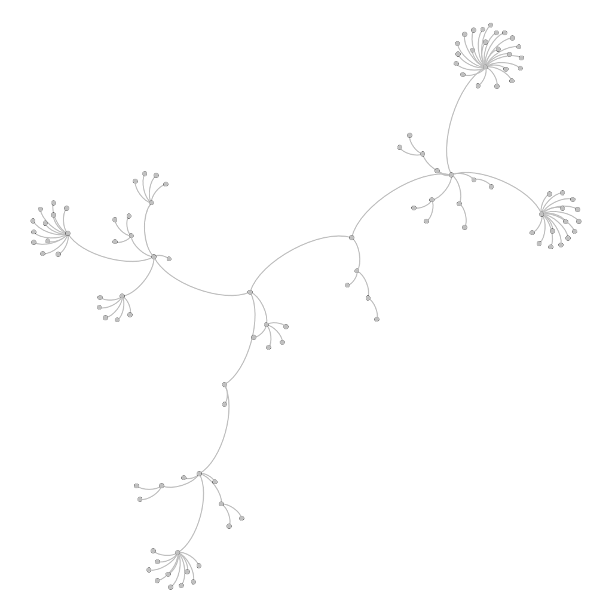
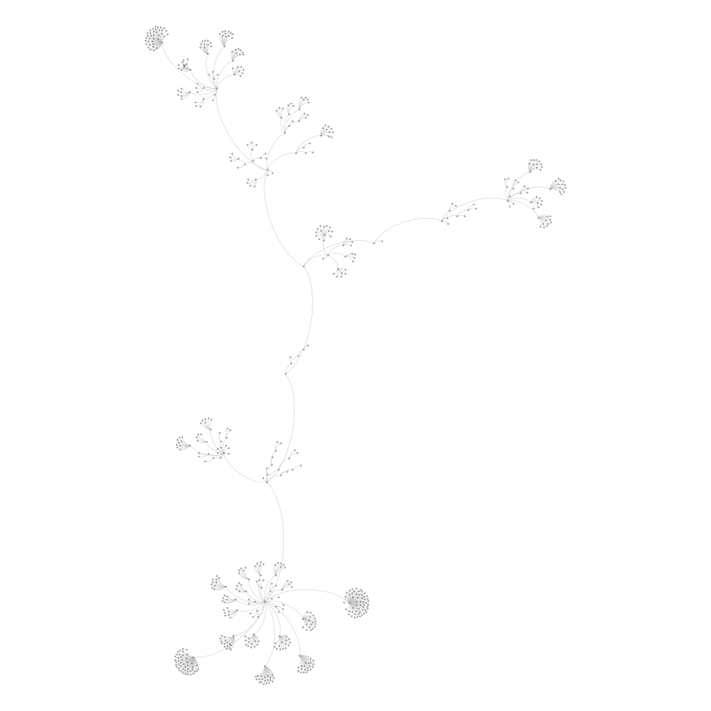
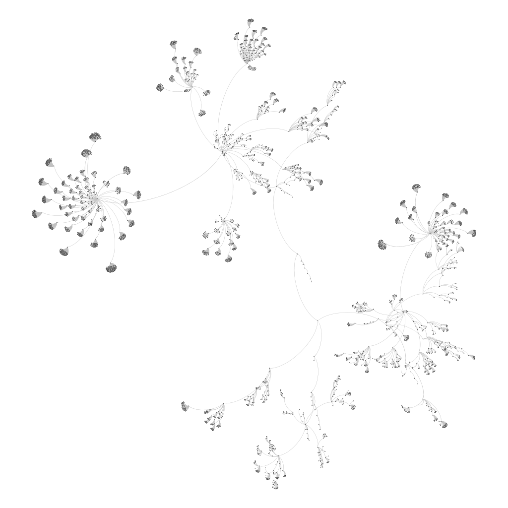

# Cubic Graph Generation
Progetto per il corso di visualizzazione delle informazioni.

Autori:
- Luca Gregori
- Alessandro Wood
## Legenda
La sezione succesiva contiene una descrizione ad alto livello dell'algoritmo, accompagnata da alcuni riferimenti alle funzioni più rilevanti, spiegate più in dettaglio nella sezione [Funzioni Rilevanti](#funzioni-rilevanti).
## Descrizione
L'algoritmo implementato è un algoritmo di enumerazione di grafi cubici a cui viene applicata una funzione [[0]](#funzioni-rilevanti) che sceglie _uniformly at random_ un grafo di cubico di **N** nodi.
L'implementazione prende, da quanto formulato nel paper "Fast Generation of Cubic Graphs", l'ordine generale delle operazioni per l'enumerazione:
1) Enumerazione dei grafi cubici primi;
2) Enumerazione di tutti gli altri grafi cubici tramite applicazione ricorsiva di una stessa trasformazione ai suddetti.

Per enumerare i grafi cubici primi [[1]](#funzioni-rilevanti)(grafi cubici i cui archi sono tutti irriducibili) si effettuano ricorsivamente tre trasformazioni, partendo dal grafo K4 [[2]](#funzioni-rilevanti):

1) Adjacent Diamond Insertion [[3]](#funzioni-rilevanti);
2) Non-Adjacent Diamond Insertion [[4]](#funzioni-rilevanti);
3) Lollipop Insertion [[5]](#funzioni-rilevanti);

Tuttavia, l'insieme dei grafi cubici primi non è chiuso rispetto a queste operazioni, pertanto è opportuno verificare ad ogni passo se il grafo generato sia primo [[6]](#funzioni-rilevanti).
Inoltre queste trasformazioni posso generare duplicati, che andranno gestiti [[7]](#funzioni-rilevanti).

Una volta enumerati i primi, si generano i restanti [[8]](#funzioni-rilevanti) grafi cubici tramite Edge Insertion[[9]](#funzioni-rilevanti).

In generale, un grafo figlio viene generato effettuando una deep copy del grafo padre [[10]](#funzioni-rilevanti), a cui successivamente viene applicata la trasformazione.

Ogni nuovo grafo ottenuto da una trasformazione viene inserito in un albero n-ario fra i figli del nodo del grafo da cui è stato generato[[11]](#funzioni-rilevanti); i puntatori ai grafi che hanno nodi pari a **N** vengono anche inseriti in un array
a cui viene applicata la funzione randomica [[0]](#funzioni-rilevanti).

Come per l'enumerazione di grafi primi, i duplicati generati anch'essi dovranno essere gestiti [[7]](#funzioni-rilevanti).


## Funzioni Rilevanti
```c
Graph* generateUniform() [0]
/*
 * Effettua una scelta random fra i grafi generati con N nodi e ritorna il grafo scelto. 
 */

void generatePrimeTrees(PrimeGraphTreeNode* treeNode, PrimeGraphTree* tree) [1]
/*
* Funzione che applica ricorsivamente le trasformazioni per i grafi primi a partire da K4 richiamando le funzioni per il check della
 * riducibilità e della gestione dei duplicati, inserendo i grafi ottenuti nell'albero n-ario.
*/
void initIrreducibleGraph(Graph* graph) [2]
/*
* initIrreducibleGraph genera a partire d un grafo vuoto un K4.
*/

int getSpareVertices(Graph* graph, int* spareVertices, int size)
/*
* Funzione che restituisce il numero di vertici spare recuperati e gli stessi che saranno 
* salvati nell'array spareVertices. Un vertice spare(" di scorta") è un vertice che non appare in nessun arco.
*/

int adjDiamondInsertion(Graph* graph, int src, int dest) [3]
/*
 * Funzione che genera una struttura K4- (K4 a cui viene tolto un arco) a partire dai nodi "Spare" 
 * e collega i due nodi della struttura con grado 2 ai nodi src e dest del grafo passato come parametro.
 */

int nonAdjDiamondInsertion(Graph* graph, int src1, int dest1, int src2, int dest2) [4]
/*
 * Funzione che genera una struttura K4- (K4 a cui viene tolto un arco) a partire dai nodi "Spare" 
 * e collega i due nodi della struttura con grado 2 
 * a 2 nuovi nodi, i quali vengono connessi uno a src1 e dest1 e il rimanente a src2 e dest2 del grafo passato come parametro.
 * */


int lollipopInsertion(Graph* graph, int src, int dest) [5]
/*
 * Funzione che genera una struttura K4+ (K4 a cui viene tolto un arco e aggiunto un nuovo nodo
 * che viene collegato agli endpoint dell'arco rimosso) a partire dai nodi "Spare" e collega il nodo della struttura con grado 2 
 * a 1 nuovo nodo, il quale viene connesso a src e dest del grafo passato come parametro.
 * */

int isAIrreducibleGraph(Graph* g) [6]
void dfsForBridge(Graph* graph, int start, int* visited)
int isABridge(Graph* graph, Edge* edge)
/*
 * Per verificare se un arco è un bridge o meno, viene rimosso momentaneamente l'arco in questione per poi
 * effettuare una dfs. Se, nonostante l'assenza dell'arco, esiste un cammino alternativo per i due endpoint dell'arco rimosso 
 * (i.e. esiste un ciclo contentente l'arco), allora l'arco non è un bridge, e lo è altrimenti.
 * */

int irreducibilityCondition2(Graph* graph, Edge* edge)
/*
 * Effettua il check della seconda condizione di irriducibilità sull'arco passato come parametro.
 * 
 * */

int irreducibilityCondition3(Graph* graph, Edge* edge)
/*
 * Effettua il check della seconda condizione di irriducibilità sull'arco passato come parametro.
 * 
 * */

void DFSforCycle(Graph* g, TriangleList* trianglelist, TetraList* tetraList, EdgeList* pathEdgeList, int* visited, int n, int vert, int start, int* count, int triangles)
/*
 * Funzione richiamata da findTriangles/findTetragons che identifica i cicli di lunghezza 3/4, 
 * alloca un triangolo/tetragono e li memorizza nella rispettiva lista.
 * */

void findTriangles(Graph* g, int update, TriangleList* trianglelist)
void findTetragons(Graph* g, int update, TetraList* tetraList)
/*
 * Un grafo è detto irriducibile(i.e. primo) se ogni suo arco è irriducibile; 
 * un arco è irriducibile se possiede almeno una di queste 3 caratteristiche (i.e. condizioni di irriducibilità):
 * 1) L'arco è un bridge( i.e. se rimosso, aumenta il # di componenti connesse del grafo);
 * 2) Uno degli endpoint dell'arco fa parte di un triangolo( ciclo di 3) di cui l'arco non fa parte;
 * 3) Entrambi gli endpoint dell'arco fanno parte di un tetragono( ciclo di 4) di cui l'arco non fa parte.
 * 
 * Per verificare l'irriducibilità di un grafo, generiamo inizialmente le liste di triangoli e tetragoni presenti in esso
 * per poi verificare su ogni arco le 3 condizioni messe in or; 
 * qualora un qualsiasi arco sia riducibile allora anche il grafo risulterà riducibile.
 * 
 * */


int check_graph_existence(PrimeGraphTreeNode* treeNode, Graph* g) [7]
/* Il grafo viene convertito in uno sparse_graph e dato in pasto a nauty 
 * che ne calcola il canonical labeling. Navigando l'albero e calcolando
 * per ciascun grafo relativo al nodo il canonical labeling, si verifica
 * infine se i due grafi sono identici (hanno stesso canonical labeling). 
 * Il check viene effettuato solamente su grafi con lo stesso # di nodi.
 * */

void recursiveGenFromPrime(PrimeGraphTreeNode* treeNode, PrimeGraphTree* tree) [8]
/*
* Funzione che applica ricorsivamente la trasformazione edge insertion a partire dai soli grafi primi richiamando la funzione
 * della gestione dei duplicati e inserendo i grafi ottenuti nell'albero n-ario.
*/

int edgeInsertion(Graph* graph, int src1, int dest1, int src2, int dest2) [9]
/*
 * Funzione che genera un arco e i due nodi che lo delimitano, per poi connettere uno di questi ultimi a src1 e dest1 e l'altro a src2 e dest2, 
 * rimuovendo preventivamente i due archi (src1, dest1) e (src2, dest2).
 */

void copyGraph(Graph* graphDest, Graph* graphSrc) [10]
/*
 * Funzione che genera una copia del grafo src nel grafo dest effettuando una copia ricorsiva delle struttura
 */
void addGraphToTree(PrimeGraphTreeNode* parent, Graph* g, PrimeGraphTree* tree, int isPrime, char* op) [11]
/*
 * Funzione che aggiunge il grafo all'albero n-ario.
 */

```
---
## Installazione

```
git clone ....
cd CubicGraphGeneration
make
./CubicGraphGen
```

---

## Visualizzazione degli alberi con Gephi

### 12 Vertici
- Grafi cubici generati con vertici <= **12**: **112** (nodi)
- Grafi cubici generati con **12** vertici: **85** (foglie)


### 14 Vertici
- Grafi cubici generati con vertici <= **14**: **621** (nodi)
- Grafi cubici generati con **14** vertici: **509** (foglie)


### 16 Vertici
- Grafi cubici generati con vertici <= **16**: **4681** (nodi)
- Grafi cubici generati con **16** vertici: **4060** (foglie)




## Riferimenti

---

Brinkmann, G.. “Fast generation of cubic graphs.” J. Graph Theory 23 (1996): 139-149.

McKay, B.D. and Piperno, A., Practical Graph Isomorphism, II, Journal of Symbolic Computation, 60 (2014), pp. 94-112.

[Link ufficiale a nauty](https://pallini.di.uniroma1.it/)

---
